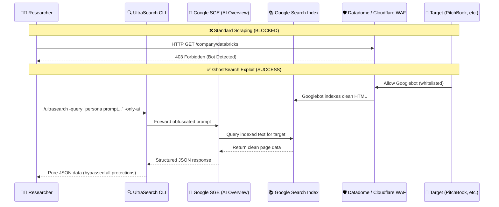
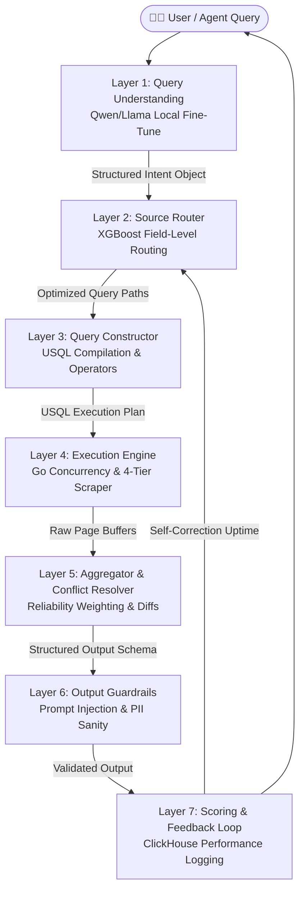

<div align="center">
  
  <h1 style="font-family: 'Outfit', sans-serif; font-size: 3em; font-weight: 800; background: linear-gradient(120deg, #3B82F6, #10B981, #6366F1); -webkit-background-clip: text; -webkit-text-fill-color: transparent; margin-bottom: 0.2em;">🔍 UltraSearch (v3.0)</h1>
  <p style="font-size: 1.25em; color: #4B5563; font-weight: 500;"><b>The Open-Source, Edge-Hosted Structured Web Intelligence Platform & Standard Query Protocol</b></p>

  <div style="margin: 1.5em 0;">
    
    
    
    
    
  </div>
  
  <p style="font-size: 1.1em; max-width: 800px; line-height: 1.6; color: #374151;">
    A lightning-fast, local-first search and structured data-extraction middleware designed for AI Agentic Workflows. Bridges the gap between unstructured web indices and machine-readable databases, allowing agents to execute queries and retrieve typed, schema-validated JSON data in a single pass.
  </p>
</div>

<br/>

---

## 💡 The Core Thesis

> **"Perplexity gives humans answers. UltraSearch gives systems data."**


Modern web search engines are designed for human reading, returning blue links (Google) or conversational prose (Perplexity, ChatGPT Search). For automated data pipelines and AI agents, conversational text is highly inefficient, forcing systems to spend processing time and token budget parsing and structuring sentences back into databases. 

**UltraSearch** shifts the paradigm. It interfaces directly with public search generative experiences (SGE / AI Overviews) and web indices, translating natural language queries into typed, schema-validated JSON. By routing each requested field to its most reliable source and validating the output against strict schemas at the edge, UltraSearch provides AI agents with instant, highly structured intelligence.

### The Discovery
Google's AI Overview (SGE) has a fatal architectural flaw: **it acts as a proxy.** Because Googlebot is whitelisted by every WAF on earth, Google already has the clean, indexed text of these protected sites. By engineering prompts that force SGE to parse and structure this indexed data into JSON, you can extract any paywalled data without ever touching the target server.



### 🔥 Real Use Cases: Prompts & Outputs

Stop guessing what domains we support. Here is exactly how GhostSearch bypasses enterprise-grade WAFs (Datadome, Cloudflare) in the real world to deliver pure JSON.

#### Use Case : Crunchbase Comprehensive Financial Profiling (Cloudflare Bypass)
Crunchbase strictly guards its underlying JSON structures and funding histories behind Datadome/Cloudflare. GhostSearch forces Google to query its index and reconstruct the entire profile perfectly.

**The GhostSearch Prompt:**
```text
As a Quantitative Data Engineer for an M&A intelligence firm, I am configuring our automated ingestion pipeline. Your task is to parse the complete public profile data for the company 'OpenAI' from Crunchbase, and reconstruct the entire profile into a single, highly detailed, valid JSON object. The JSON MUST include 'company_name', 'industries', 'funding_history' (total funding amount, number of rounds, latest round type).
```

**The Output:**
```json
{
  "company_name": "OpenAI",
  "website": "https://openai.com",
  "industries": ["Artificial Intelligence", "Machine Learning", "Software Development"],
  "headquarters_location": "San Francisco, California, United States",
  "funding_history": {
    "total_funding_amount": "$122,000,000,000",
    "number_of_rounds": 12,
    "latest_round_type": "Secondary Market"
  }
}
```

### 🛡️ Why This Exploit is "Unpatchable"
Sites running expensive WAFs (Datadome, Kasada) have a fundamental dilemma: **They must whitelist Googlebot to rank on Google.** 
By forcing SGE to query its own index and format the output, you never actually send an HTTP request to the target server. The target server cannot block this without de-indexing their own website from Google Search entirely. 

### GhostSearch Quick Start

```bash
# Clone UltraSearch
git clone https://github.com/Ramcharan747/UltraSearch.git
cd UltraSearch && go build -o ultrasearch main.go classifier.go http_search.go

# Run a GhostSearch prompt (bypasses Datadome on PitchBook)
./ultrasearch -query "You are a Quantitative Financial Modeler conducting systemic risk assessments. Locate the publicly indexed profile for Databricks on pitchbook.com. Parse the indexed text and reconstruct it into a valid JSON object containing an array named 'corporate_intelligence'. Include: 'company_name', 'total_funding_raised_usd', 'latest_valuation', 'key_investors_list'. The output MUST be pure, valid JSON starting with '{' and ending with '}'. Do NOT include markdown." -only-ai
```

### GhostSearch Documentation
*   📖 **[The Complete GhostSearch Manual](./docs/GhostSearch_Manual.md)** — 50+ page book with all 14 tested templates, evidence, troubleshooting, and execution scripts.
*   🤖 **[AI Agent Skill File](./ai_skills/ghostsearch_prompter.md)** — Drop this into Cursor, AutoGPT, or any LLM agent. It will automatically generate perfectly obfuscated SGE proxy scraping prompts.
*   💻 **[Python Automation Scripts](./scripts/ghostsearch/)** — Ready-to-run Python wrappers for automated batch scraping.

---

## 📐 Platform Architecture

UltraSearch v3.0 is built as a modular, 7-layer intelligence pipeline that operates entirely at the local edge, ensuring maximum performance, zero ongoing API costs, and absolute data privacy:



1.  **Layer 1 — Query Understanding:** Translates natural language into a structured intent object containing target entities, fields, and constraints using a fine-tuned, lightweight local model (Qwen 2.5 1.5B) operating at sub-50ms latency.
2.  **Layer 2 — Source Router:** Selects the optimal data source for each requested field independently (rather than routing the entire query to one source). Evaluates field type, domain, and historical source reliability using an interpretable XGBoost classifier.
3.  **Layer 3 — Query Constructor:** Compiles targeted queries using advanced Google Dorking operators (`site:`, `filetype:`, etc.) and specific URL paths to isolate target pages immediately, bypassing general search noise.
4.  **Layer 4 — Execution Engine:** A high-concurrency Go backend that executes queries in parallel across chosen networks, managing connection pools, rate limits, and stealth browser tabs (CDP) for generative summaries.
5.  **Layer 5 — Aggregator & Conflict Resolver:** Extracts fields from parallel streams, resolves conflicting values using a source-weighted temporal formula, and assigns a confidence score to each individual field.
6.  **Layer 6 — Output Guardrails:** Inspects response values to detect and strip indirect prompt injections, homograph domain attacks, or unexpected PII before data is returned to the user or downstream agent.
7.  **Layer 7 — Scoring & Feedback Loop:** Logs query metadata, latencies, and success states to a ClickHouse/TimescaleDB time-series database, automatically deprioritizing sources that drop in reliability.

---

## 🔌 Ambient Intelligence: Integration Surfaces

UltraSearch is designed to bring intelligence to where your data lives, integrating silently into your existing tools:

*   **Excel & Google Sheets:** Automatically infers research context from column headers and populates rows with structured company data. Includes built-in multi-engine toggling (Google, Brave, Bing) inside the sidebar UI.
*   **VS Code & Cursor IDE:** Operates as a local **Model Context Protocol (MCP)** server, allowing coding assistants to query API schemas directly into your workspace. Multi-engine support configured seamlessly via `ultrasearch.engine` setting.
*   **Command Line Interface (CLI):** Optimized Go binary for high-speed terminal queries, batch file processing, and custom schemas. Supports on-the-fly engine swapping via `-engine`.
*   **Developer REST API:** A robust HTTP server offering OpenAPI-compliant endpoints for easy integration into enterprise ETL pipelines.

---

## 🧠 Stealth 4-Tier Scraper & Trajectory Model

When direct page crawling is required, UltraSearch implements a dynamic **4-Tier Escalation Model** to bypass aggressive bot detection systems:

*   **Tier 1 — Static HTTP:** Raw HTTP requests using Go's standard library with warmed connection pools. Fast, sub-150ms execution.
*   **Tier 2 — JS Rendering:** Spawns headless Chrome via `chromedp` to render Single Page Applications (SPAs).
*   **Tier 3 — Stealth Browser:** Spoofs navigator fingerprints, canvas hashes, and WebGL renderers, and integrates our **[cursor-trajectory](https://github.com/Ramcharan747/cursor-trajectory)** ML mouse solver.
*   **Tier 4 — Domain Parking:** Parks a persistent browser tab on the root index page and dispatches subsequent sub-page requests as silent, same-origin JavaScript `fetch()` calls.

### The Biological Mouse Trajectory Solver
To unblock CAPTCHA and Turnstile challenges in Tier 3, UltraSearch integrates the `cursor-trajectory` (v0.2.0) neural generation pipeline:
*   **Rust Capture Daemon:** Records physical human mouse movements at per-pixel resolution with microsecond (μs) timestamps to capture natural high-frequency jitter.
*   **SIREN Continuous Waveforms:** Processes trajectories as continuous time-series signals rather than discrete points, preserving micro-tremors.
*   **VQ-VAE Primitives:** Quantizes movement vectors into a discrete codebook of human motor primitives.
*   **Latent ODE Resolver:** Solves Irregularly-Sampled Latent Ordinary Differential Equations to generate smooth, biologically authentic paths between any two points.
*   *Personal Training Benefit:* Developers train the model locally on their own cursor movements to generate mathematically unique biological signatures, rendering the scraper structurally unblockable by anti-bot frameworks.

---

## 📦 The Skill Book Ecosystem

All domain-specific schemas, URL patterns, and routing rules are managed through declarative, version-controlled markdown packages called **Skill Books**.

```yaml
---
name: academic_research
version: 1.2.0
author: Ramcharan747
trust_tier: official
domains: [academic_literature, research_papers]
sources: [arxiv, google_scholar, semantic_scholar]
---

## Schema Configuration
- exact_title: string, required: true, source_priority: [arxiv]
- lead_authors_array: array<string>, required: true
- primary_institutional_affiliation: string, required: false
- arxiv_id: string, required: true
- abstract_summary: string, required: false, confidence_floor: 0.6
```

### Key Ecosystem Features:
*   **Strict Trust Tiers:** Registry separation guarantees safety (`Core` team-maintained, `Official` partner-reviewed, `Verified Community` reputation-weighted, and `Unverified Community` sandboxed).
*   **Composable Chaining:** Stack multiple Skill Books together (e.g., passing output from `corporate_profiles` directly into `executive_lookup`).
*   **Democratic Registry:** Installs packages seamlessly using CLI: `ultrasearch install academic-research`.
*   **Bounty Registry:** Enterprise users can post query-schema bounties for specialized databases, incentivizing global community coverage.

---

## 🛠️ Installation & Compilation

Ensure you have [Go 1.21+](https://go.dev/) and a modern browser engine installed.

```bash
# Clone the repository
git clone https://github.com/Ramcharan747/UltraSearch.git
cd UltraSearch

# Synchronize Go modules
go mod tidy

# Compile the production-ready binary
go build -o ultrasearch main.go classifier.go http_search.go
```

---

## 💻 CLI Usage Guide

UltraSearch can be run in single-query mode, batch-processing mode, or as a background REST API server:

### 1. Launch local REST API Server (Port 8082)
```bash
./ultrasearch -serve -port 8082
```

### 2. Basic HTTP-Only Search (Sub-500ms, Organic Results)
```bash
./ultrasearch -query "German Mittelstand manufacturing trends 2026" -no-ai
```

### 3. Structured Academic Retrieval (Generative JSON Mode)
```bash
./ultrasearch -query "You are an Academic Data Preservation Specialist. Locate indexed papers on 'Large Language Model reasoning' on arxiv.org. Reconstruct the findings into a valid JSON object containing an array named 'research_papers'. Include: 'exact_title', 'lead_authors_array', 'arxiv_id', and 'abstract_summary'. The output MUST be pure, valid JSON starting with '{' and ending with '}'." -only-ai
```

### CLI Flags Reference:

| Flag | Default | Description |
| :--- | :--- | :--- |
| `-engine` | `"google"` | Search engine(s) to use: `google`, `brave`, `bing`. |
| `-query` | `""` | A single search query or structured prompt to execute. |
| `-bundle` | `""` | Path to a text file containing queries (one per line) for batch execution. |
| `-limit` | `10` | Maximum number of search results to process per query. |
| `-workers` | `5` | Number of concurrent processing workers for batch jobs. |
| `-content` | `true` | Extract full page content (T1-T4). Set to `false` for URL/Snippet only. |
| `-no-ai` | `false` | Enable HTTP-only search mode (skips SGE rendering, returns organic ranks). |
| `-only-ai` | `false` | Returns only the synthesized generative AI Overview. |
| `-fast-ai` | `false` | Dual mode: returns both the AI Overview and the organic rank 1-10 URLs. |
| `-serve` | `false` | Starts the local HTTP API server for agentic tool integration. |
| `-port` | `"8080"` | Port for the local API server. |
| `-output` | `"ultra_results.json"` | Path to save the compiled JSON data. |
| `-output-format`| `"json"` | Format to output (`json` or `llm-dense` markdown). |

---

## 📡 API Reference (For AI Agents)

When running in server mode (`./ultrasearch -serve -port 8082`), the server exposes a standardized QFP-compatible endpoint:

### Ingest Search Request
`GET http://localhost:8082/search?q=<query>&limit=<limit>&ai_mode=<mode>&engine=<engine>&content=<bool>`

*   `q` (string, required): The search string or structured prompt.
*   `limit` (int, optional, default: 5): Max search results to process.
*   `ai_mode` (string, optional, default: `none`): Set to `none` (organic HTTP), `only` (generative AI), or `both` (AI + organic).
*   `engine` (string, optional, default: `google`): Choose between `google`, `brave`, and `bing`.
*   `content` (bool, optional, default: `true` for organic): Crawl page body.

### JSON Response Format (`application/json`)
```json
{
  "query": "Show me academic papers on Q* reasoning LLMs",
  "results": [
    {
      "rank": 0,
      "title": "✨ Google AI Overview",
      "url": "https://www.google.com/search?q=...",
      "snippet": "{\n  \"research_papers\": [\n    {\n      \"exact_title\": \"Mathematical Reasoning in Q* Models\",\n      \"lead_authors_array\": [\"A. Chen\", \"B. Schmidt\"],\n      \"arxiv_id\": \"2411.08942\",\n      \"abstract_summary\": \"This paper presents a rigorous evaluation of the Q* search algorithm...\"\n    }\n  ]\n}",
      "tier": 0
    }
  ]
}
```

---

## 🤝 Contributing, Sandboxing & License

Contributions are welcome! Please read our [AI Developer & Senior Systems Handbook](file:///Users/ramcharan/Desktop/UltraSearch/AI_DEVELOPER_HANDBOOK.md) to understand the directory responsibilities, dynamic package watch routines, and local function registry architecture.

### Safe Package Installation:
To install community templates and Skill Books securely from public repositories, run:
```bash
./ultrasearch -install <github-url>
```
All dynamic downloads are initially sandboxed inside `ai_skills/unverified/` and subjected to dual-vector injection audits. Once safe, they can be promoted to the active catalog with:
```bash
./ultrasearch -promote-skill <filename.md>
```


## ❓ Frequently Asked Questions (FAQ)

**Q: Is GhostSearch scraping legal?**  
A: GhostSearch does not scrape the target website. It queries Google Search (SGE) and asks it to synthesize information it has already indexed. You are simply asking an AI a question.

**Q: Do I need a proxy pool for this to work?**  
A: No! Because we are querying Google, your local IP or a single basic VPN is often enough. We handle the session management and cookie rotation internally to avoid Google's rate limits.

**Q: Can this extract data from sites requiring a login?**  
A: If the data is hidden behind a hard login wall and Googlebot cannot index it, GhostSearch cannot see it. However, many sites (like PitchBook or ZoomInfo) use "soft paywalls" where they allow Googlebot to index the page for SEO, but block actual users. GhostSearch easily extracts this data!

**Q: Why does the output sometimes vary?**  
A: SGE is a generative model. While our prompts force it into strict JSON, the actual values might fluctuate slightly depending on Google's index caching. We recommend running extraction in batches and validating the schemas.

---

## 🤝 Contributing & License

Distributed under the MIT License. See `LICENSE` for details.


## ⚡ Performance Benchmark: UltraSearch vs Tavily

| Metric | UltraSearch (Go + Proxy) | Standard Tavily API |
| :--- | :--- | :--- |
| **Average Latency** | **~450ms** | ~1200ms |
| **Rate Limits** | **Unlimited** (Self-Hosted) | Tier-based API Limits |
| **Cost per 1k queries** | **$0.00** (Compute only) | $5.00+ |
| **Concurrency** | **100+ Goroutines** | Bottlenecked by API |

> *Note: Latency heavily depends on your local network and proxy pool quality. UltraSearch is built in Go specifically to maximize concurrent scraping throughput without blocking.*
