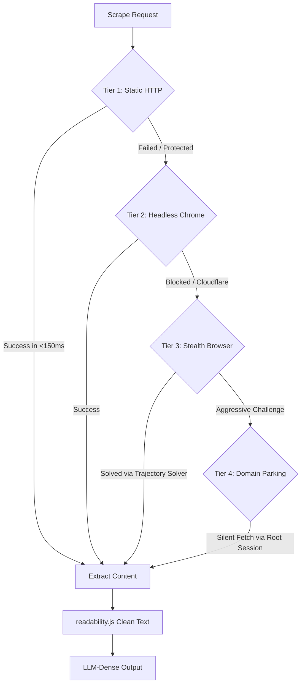

<div align="center">
  
  <h1>🔍 UltraSearch (v2.01)</h1>
  <p><b>The Unrestricted, Self-Hosted Tavily Alternative for Local AI Agents</b></p>
  
  [](https://golang.org)
  [](https://opensource.org/licenses/MIT)
  [](#stealth)
  [](#vs-code--cursor-integration)
</div>

<br/>

**UltraSearch** is a self-hosted, unrestricted web search and page content extraction engine designed specifically for **AI Agentic Workflows** (Cursor, OpenClaw, AutoGPT, LangChain). 

Tired of commercial search API rate limits, expensive credits, and restrictive scraping policies? UltraSearch runs entirely on your local machine, feeding raw, pristine, token-optimized data directly into your LLM's context window.

---

## ⚡ What, How, and Why?

### The "Why" (The Motivation)
AI agents require real-time information to complete coding and research tasks. Commercial search APIs (like Tavily, Serper, or Google Custom Search) have major limitations:
1. **High Costs:** Pay-per-query credits accumulate quickly during agent loops.
2. **Scraping Blocks:** They often return only search snippets, missing the full page body because the target website blocks standard HTTP crawlers.
3. **No SGE:** They lack access to Google's generative **AI Overviews (SGE)**.

UltraSearch solves this by running a smart local engine that escalates requests automatically, using a pre-trained **human mouse trajectory solver** to bypass captchas, and stripping HTML into token-optimized text.

### The "How" (4-Tier Escalation Model)
UltraSearch doesn't waste heavy browser resources on simple pages. It routes requests dynamically to maximize speed and bypass protection:



* **Tier 1 (Static HTTP):** Performs ultra-fast HTTP queries using headers/cookies from our active session pool.
* **Tier 2 (JS Rendered):** Spawns a headless browser to render SPAs (React, Angular) and extract client-side dynamic text.
* **Tier 3 (Stealth Browser):** Evades detection using OS-level browser spoofing and a machine-learning mouse trajectory solver.
* **Tier 4 (Domain Parking):** Parks a background browser on the root domain and executes silent sub-page fetches using the cleared session to avoid resetting session firewalls.

---

## 🆕 New in Version 2.01: Modular Search Modes

We have refactored our core pipeline to introduce three distinct search modes to control how queries are resolved, providing up to **5x faster search speeds** depending on your latency requirements:

### 1. HTTP-Only Search (`-no-ai` / `ai_mode=none`)
* **How it works:** Skips Chrome browser rendering entirely. Performs raw, pre-warmed HTTP requests using session tokens from our session manager.
* **Performance:** **Sub-500ms results** (typically ~120ms network request + parsing overhead).
* **Output:** Organic rank 1-10 search result links and snippets (AI Overview is completely filtered out).

### 2. Only AI Overview (`-only-ai` / `ai_mode=only`)
* **How it works:** Spawns a stealth browser tab to navigate Google Search and extracts only the SGE (Google AI Overview) text box (Rank 0 result).
* **Output:** Re-synthesized generative summary. Organic links are omitted.

### 3. Dual Mode (`-fast-ai` / `ai_mode=both`)
* **How it works:** Spawns a stealth browser tab and captures both the SGE Overview and the organic rank 1-10 results.
* **Output:** Generative summary + 10 organic URLs.

---

## 🔑 Hybrid Session Pool Manager

To make HTTP-Only search (`-no-ai`) work without triggering Google's rate-limiting or CAPTCHAs, UltraSearch maintains a background **Session Pool** (`solver/session_config.json`):
1. **Sniffing:** During browser searches, it listens to the network protocol and intercepts authenticated cookies and request headers.
2. **Persistence:** Sessions are saved with custom metadata (`use_count`, `created_at`, `blocked`).
3. **Eviction:** Sessions are automatically rotated after 5 uses or immediately evicted if they return a 429 status code.
4. **Replenishment:** The pool spawns a silent background worker to replenish tokens before they run out.

---

## 🔌 VS Code & Cursor IDE Integration

UltraSearch contains a native VS Code wrapper (`vscode-ultrasearch/`) so that coding assistants (like **Cursor** or **GitHub Copilot**) can command your local engine to search the web directly inside your project workspace.

### Packaging & Installation
1. Navigate to the extension folder:
   ```bash
   cd vscode-ultrasearch
   npm install
   ```
2. Package the extension to a `.vsix` file:
   ```bash
   npx vsce package
   ```
3. Install the generated `.vsix` in your editor (e.g., in VS Code, click *Extensions -> ... -> Install from VSIX...*).

### Commands Available

| commandId | Command Name | Under-the-Hood CLI Execution |
| :--- | :--- | :--- |
| `ultrasearch.search` | **Deep Web Search** | `ultrasearch -query "..." -no-ai` (Retrieves full page bodies) |
| `ultrasearch.fastSearch` | **AI Overview & 10 URLs** | `ultrasearch -query "..." -fast-ai` |
| `ultrasearch.quickUrls` | **Quick 10 URLs (HTTP)** | `ultrasearch -query "..." -no-ai -content=false` (Sub-500ms) |
| `ultrasearch.onlyAI` | **Only AI Overview** | `ultrasearch -query "..." -only-ai` |

---

## 🚀 Installation & CLI Build

Ensure you have [Go 1.21+](https://go.dev/) installed.

```bash
# Clone the repository
git clone https://github.com/Ramcharan747/UltraSearch.git
cd UltraSearch

# Install package dependencies
go mod tidy

# Compile the project binary
go build -o ultrasearch main.go classifier.go http_search.go
```

---

## 💻 CLI Flags Reference

You can run UltraSearch in single-query mode, batch-processing mode, or as a background API server:

```bash
# Start the local API server on port 8082 for your AI Agents
./ultrasearch -serve -port 8082

# Run a quick, HTTP-only URL search
./ultrasearch -query "best startups in silicon valley 2026" -no-ai -content=false
```

| Flag | Default | Description |
| :--- | :--- | :--- |
| `-query` | `""` | A single search query string to execute. |
| `-bundle` | `""` | Path to a text file containing queries (one per line). |
| `-limit` | `10` | Maximum number of search results to process per query. |
| `-workers` | `5` | Number of concurrent processing workers to spawn. |
| `-content` | `true` | Extract full page content (T1-T4). Set to `false` for URL/Snippet only. |
| `-no-ai` | `false` | Enable HTTP-only search mode (skips SGE rendering). |
| `-only-ai` | `false` | Returns only SGE AI Overview if it exists. |
| `-fast-ai` | `false` | Dual mode: returns SGE overview and organic URLs. |
| `-serve` | `false` | Starts the HTTP API server for agent integration. |
| `-port` | `"8080"` | Port for the HTTP server. |
| `-output` | `"ultra_results.json"` | Path to save the extracted JSON data. |
| `-output-format`| `"json"` | Format to output (`json` or `llm-dense`). |

---

## 🤝 Contribution & License

Contributions are welcome! Please open a Pull Request or issue to discuss additions.
Distributed under the MIT License. See `LICENSE` for details.
