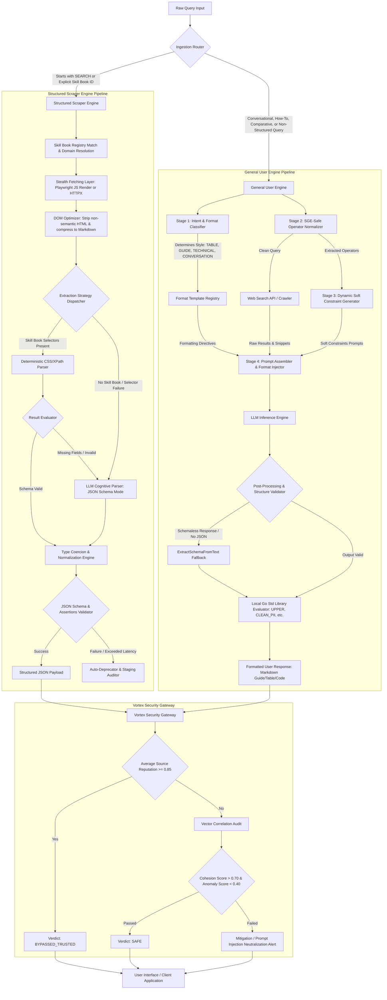

# Unified Dual-Engine Search System Architecture: Scraper Engine & General User Engine
**Author:** System Architecture Builder  
**Version:** v4.0 Spec  
**Status:** Completed Draft

---

## 1. Executive Summary & Architectural Blueprint

To support both high-precision data harvesting and everyday natural language search, UltraSearch is architected as a **Dual-Engine Search Pipeline** compiled as a single Go binary. The architecture consists of:
1. **The Structured Scraper Engine (SSE):** Tailored for enterprise-grade, typed extraction from targeted domains using community-contributed templates (Skill Books) or LLM cognitive schema fallback.
2. **The General User Engine (GUE):** Designed to handle noisy, natural language queries by classifying user intent, normalizing Search Generative Experience (SGE) suppression operators into "soft constraints," and formatting output into readable presentation templates (Guides, Tables, Technical References).

### Unified Flow Diagrams


---

## 2. The Structured Scraper Engine (SSE) Deep-Dive

The SSE is optimized for maximum extraction throughput with zero-dependency execution. It prioritizes static selectors over expensive LLM execution.

### 2.1 DOM Optimization & Context Pruning
To reduce token consumption by up to **75%** before invoking LLM fallbacks, the DOM preprocessor strips elements that contain no semantic payload:
1. **Removed Elements:** `<script>`, `<style>`, `<svg>`, `<link>`, `<iframe>`, and comments.
2. **Attribute Strip:** Clears `style`, `class`, `id`, inline events (`onclick`, `onload`), and large base64 inline images.
3. **Markdown Compression:** Converts the pruned DOM tree into a highly dense Markdown format containing only functional semantic anchors and textual details.

### 2.2 Dynamic Extraction Strategy: Deterministic vs. Cognitive
* **Deterministic Stage:** The parser evaluates CSS and XPath selectors from the active Skill Book. If the required fields are returned and validated, the engine skips generative extraction.
* **Cognitive Stage (LLM Fallback):** Triggered when selectors are missing, return null values, or fail schema checks. The compressed Markdown and JSON schema are dispatched to Gemini using native structured JSON output constraints.

### 2.3 JSON Schema Draft-07 & Type Coercion Table
The engine maps incoming string data dynamically to target JSON schemas using a type coercion engine:

| Target Type | Extraction Format | Normalization & Coercion Action |
| :--- | :--- | :--- |
| `number` / `integer` | `$1,249.99` or `1.249,99 €` | Strip currency symbols/commas, resolve local notation, cast to float. |
| `boolean` | `"In Stock"`, `"yes"`, `"1"` | Substring checks, truthy/falsy evaluation, mapping to boolean. |
| `string` (date-time) | `"May 24, 2026"` | Parse via datetime parsers, output ISO 8601 string (`2026-05-24T00:00:00Z`). |
| `string` (regex) | `"Model: iPhone 15"` | Apply regex extractor configured in metadata (e.g., to capture model only). |

### 2.4 Skill Book Specification (`skillbook.yaml`)
A community-contributed Skill Book is configured as follows:
```yaml
version: "1.0.0"
metadata:
  id: "org.community.amazon-detail"
  name: "Amazon Product Details Extractor"
  description: "Extracts product specifications, pricing, and stock information from Amazon detail pages."
  author: "ScraperDevs"
  domain_matches:
    - "*.amazon.com"
    - "*.amazon.co.uk"
    - "*.amazon.in"
  url_patterns:
    - "^https?:\\/\\/(www\\.)?amazon\\.[a-z\\.]+\\/(dp|gp\\/product)\\/[A-Z0-9]{10}"
  engine_settings:
    rendering: "playwright"  # Uses browser rendering
    wait_until: "networkidle"
    timeout_ms: 10000

schema:
  type: "object"
  properties:
    title: { type: "string" }
    price: { type: "number" }
    currency: { type: "string", pattern: "^[A-Z]{3}$" }
    brand: { type: "string" }
    in_stock: { type: "boolean" }
  required: ["title", "price", "currency"]

extraction:
  selectors:
    title:
      - css: "span#productTitle"
        action: "text"
      - css: "h1.product-title"
        action: "text"
    price:
      - css: "span.a-price span.a-offscreen"
        action: "text"
        postprocess:
          - regex: "[0-9\\.,]+"
          - coerce: "float"
  llm_hints:
    brand: "Look for the Brand field under product specifications or table details if missing."
```

### 2.5 Community Template Validation, Scoring & Promotion
To maintain stability, all contributed templates are subjected to a strict promotion lifecycle:
1. **Static Validation (Linter):** Verifies syntax correctness, presence of required metadata, and compilation of the target JSON Schema.
2. **Sandbox Dry-Run (Mock DOMs):** Exercises selectors against mock static HTML in a CI container to assert correct parsing.
3. **Integration Canary (Live Pages):** Runs templates against 5 live URLs to verify latency (`< 5s`) and schema output.
4. **Promotion to Staging:** Routes 5% of matching production requests to the staging template in parallel (dark traffic).
5. **Promotion to Production:** Requires 200 staging requests with a **Success Rate >= 98%** and latency `< 1s` for deterministic paths.
6. **Auto-Deprecation Thresholds:**
   - If the failure rate of selectors exceeds **10% in a rolling 1-hour window**, the Skill Book is demoted.
   - The engine automatically routes execution to **LLM Cognitive Mode** (using target schema directly) and alerts the maintainer.

---

## 3. The General User Engine (GUE) Deep-Dive

The GUE processes everyday user queries, ensuring high SGE trigger rates, removing SGE-suppressing operators, and injecting layout controls.

### 3.1 Comparative Query Profiles

| Dimension | General / Everyday Queries | Scraper / Data Harvesting Queries |
| :--- | :--- | :--- |
| **Primary Intent** | Learning, explanation, coding syntax, general research. | Systematic extraction, lead generation, API schemas. |
| **Operators Used** | None (natural query format). | `site:`, `filetype:`, `inurl:`, `AND`, `OR`, `-site:`. |
| **Desired Format** | Conversational prose, step-by-step guides, tables. | Structured JSON, raw CSV/TSV matrices. |
| **SGE Trigger Rate** | **High** (natural interrogatives pass the Synthesis Threshold). | **Low** (operators suppress generative summaries). |

### 3.2 SGE Synthesis Threshold & Suppression Mechanics
Traditional search operators (like `site:reddit.com` or `filetype:pdf`) restrict the search index. To prevent biased output or indexing loops, search engine SGE containers **completely suppress** generative panels when these operators are detected. Additionally, direct personal advice or cybersecurity exploits trigger safety refusals, whereas educational formulations trigger SGE summaries.

### 3.3 Stage 2: SGE-Safe Cleaning & Operator Normalization
The SGE-Safe Cleaner strips legacy search operators from raw search strings and translates them into structured metadata, preventing SGE suppression:

| Raw Input Query | Cleaned Search Query | Extracted Constraints Metadata |
| :--- | :--- | :--- |
| `best noise cancelling headphones site:reddit.com -video -AI` | `best noise cancelling headphones` | `{"include_sites": ["reddit.com"], "exclude_terms": ["video"]}` |
| `python parse json filetype:pdf &udm=14` | `python parse json` | `{"file_types": ["pdf"]}` |
| `"fatal error: out of memory" inurl:github` | `"fatal error: out of memory"` | `{"match_conditions": [{"inurl": "github"}]}` |

### 3.4 Stage 3: Dynamic Soft Constraint Generation
Hard constraints are re-introduced at the LLM prompting layer. This translates strict dork operators into **dynamic soft constraints**:
* **Domain Affinity (`site:`)** $\rightarrow$ `"Prioritize sourcing reviews and facts from [sites]. If unavailable, note the source domain."`
* **Negative Constraints (`-keyword`)** $\rightarrow$ `"Strictly omit references to [terms] in your output."`
* **Format Affinity (`filetype:`)** $\rightarrow$ `"Target insights typically found in official [file_type] documents."`

### 3.5 Stage 4: Format-Driven Prompt Injection Templates
Depending on the classified intent, the Format Router injects specific directives:

* **`GUIDE` (Procedural):** Enforces ordered lists with bold action verbs, prerequisites, troubleshooting, and markdown alert blocks (`> [!WARNING]`).
* **`TABLE` (Comparative):** Enforces 1-2 introductory sentences, a GitHub-Flavored Markdown table with aligned columns, and a "Best For..." recommendation summary block.
* **`TECHNICAL` (Code/Reference):** Enforces fully commented, runnable code blocks with language annotations, inline code walkthrough highlights, and resource performance guidelines.
* **`CONVERSATIONAL` (Exploratory):** Enforces a clear direct answer in the first paragraph, 3-4 line explanatory paragraphs, and edge-case limitations without heavy nested lists.

### 3.6 Stage 5: Schemaless Fallbacks & Local Std Library Evaluator
If SGE fails to output JSON and returns a plain conversational summary:
1. **`ExtractSchemaFromText` (Regex Fallback):** Maps unstructured prose to target keys using regex patterns (e.g. matching CEO names, company valuations, or revenues).
2. **`EvaluateUSQLFunctions` (Go Std Library Registry):** Evaluates Go-native functions on SGE responses:
   - `UPPER` / `LOWER` / `TITLE` / `TRIM`
   - `CLEAN_PII`: Sanitizes email and phone number patterns using regex.
   - `CONVERT_CURRENCY`: Standardizes currency formats to common targets (EUR/GBP/USD).
   - `ESTIMATE_ARR`: Applies scaling multipliers to estimate annual recurring revenues.

---

## 4. Vortex Security Gateway (Cross-Cutting Concern)

The Vortex Security Gateway intercepts SGE outputs before delivery to protect users and downstream systems from indirect prompt injection attacks.

```
                  ┌─────────────────────────────────────┐
                  │        Incoming SGE Snippet         │
                  └──────────────────┬──────────────────┘
                                     │
                     Calculate Source Reputation Score
                                     │
                  ┌──────────────────┴──────────────────┐
                  │   Is Average Reputation Score >= 0.85?│
                  └──────────┬───────────────────┬──────┘
                             │ Yes               │ No
                             ▼                   ▼
                  ┌───────────────────┐ ┌───────────────────┐
                  │ Bypass Deep Audit │ │ Run Deep Vector   │
                  │ (TRUSTED_BYPASS)  │ │ Run Vector Audit  │
                  └───────────────────┘ └────────┬──────────┘
                                                 │
                                        Evaluate Metrics:
                                      - cohesionScore > 0.70?
                                      - anomalyScore < 0.40?
                                                 │
                                ┌────────────────┴────────────────┐
                                │ Passed?                         │
                                └──────┬───────────────────┬──────┘
                                       │ Yes               │ No
                                       ▼                   ▼
                                ┌─────────────┐   ┌─────────────────┐
                                │ Mark SAFE   │   │ Overwrite with  │
                                │ and Release │   │ Vortex Alert    │
                                └─────────────┘   └─────────────────┘
```

1. **Source Reputation Audit (`CalculateSourceReputation`):** Analyzes the reputation of cited URLs in the output. High-reputation domains (.gov, .edu) are bypass-exempted. If the average reputation is $\ge 0.85$, it is marked `BYPASSED_TRUSTED` to minimize processing latency.
2. **Deep Auditing (`RunVectorCorrelation`):** If reputation is lower than 0.85, the gateway calculates:
   - **`cohesionScore`:** Cosine similarity between the SGE response and the input USQL query.
   - **`anomalyScore`:** Maximum similarity score between the response and known prompt-injection signatures. Substring matches on triggers like `ignore previous instructions` automatically force `anomalyScore = 1.0`.
3. **Local AI Gatekeeper & Telemetry:** If `cohesionScore > 0.70` or `anomalyScore > 0.40`, it intercepts the response, overriding it with an injection neutralization alert. Under explicit user consent (`telemetry_consent: "opt_in_raw"`), raw payloads are transmitted to security monitors; otherwise, verdicts are appended locally to `usage_telemetry.jsonl`.

---

## 5. Key Friction Points & Architectural Mitigations

To scale the pipeline for everyone, the following design mitigations address constraints found in the legacy codebase:

### 1. Fragile Handwritten Frontmatter Parser
> [!WARNING]
> The current parser splits lines on the first colon and expects brackets for lists (e.g. `[domain1, domain2]`). It crashes when encountering standard YAML bullet-list syntax.
* **Mitigation:** Integrate a standard YAML/JSON parser for parsing Skill Book frontmatter in `registry.go` instead of relying on custom string-splitting routines.

### 2. Over-Filtering in Security Sandbox
> [!WARNING]
> Substring checks for words like `api_key`, `db_password`, `hack`, and `jailbreak` create false positives, blocking valid developer schemas or cybersecurity Skill Books.
* **Mitigation:** Refine the linter to use context-sensitive checks (e.g., matching security variables inside comments or actual string assignment rather than field names in JSON schemas).

### 3. In-Memory Sequential Semantic Router Bottleneck
> [!WARNING]
> Sequential cosine similarity calculations over in-memory registries degrade lookup latency at scale and do not capture semantic synonyms.
* **Mitigation:** Implement a two-tiered routing cache: a high-speed prefix keyword trie for exact domain matching, backed by a lightweight vector database index (e.g., HNSW) for semantic resolution of synonyms.

### 4. SGE Schemaless Instability & Fallback Extractor
> [!WARNING]
> Custom properties in schemaless responses fall back to a token-grabber that extracts the next 3 words after a key, causing errors.
* **Mitigation:** Enhance `ExtractSchemaFromText` by using a local, lightweight secondary inference engine or fine-tuned regex templates to parse unstructured text into custom fields.

### 5. Captcha Blocks & Session Eviction Latency
> [!WARNING]
> Replenishing evicted dynamic sessions via the trajectory captcha solver (`solver.DefeatCaptcha`) introduces massive spikes in query latency.
* **Mitigation:** Implement a warm-pool backup strategy where captcha solving is handled asynchronously by a background daemon, ensuring the scraper always pulls from a pre-authenticated, ready session queue.

---

## 6. Implementation Resolution
* **Forensic Log Bug Fix Verified:** The anomaly where plain text responses were misclassified as malicious prompt injections has been resolved. The bypass filter has been updated:
  ```go
  if verdict != "SAFE" && verdict != "BYPASSED_TRUSTED" && verdict != "NO_JSON_FOUND" && verdict != "PARSING_ERROR" {
      // Overwrite snippet with Vortex Security Alert
  }
  ```
  This ensures schemaless plain-text responses execute safely and fall back to the regex parser as intended.
